# Taller MYSQL

## Modelo Físico
### Creación de tablas.

````sql
CREATE TABLE clientes (
cliente_id INT PRIMARY KEY AUTO_INCREMENT,
nombre VARCHAR(50),
email VARCHAR(50) UNIQUE,
telefono VARCHAR(15),
direccion VARCHAR(100),
ciudad VARCHAR(50),
pais VARCHAR(50),
fecha_registro DATE
);


CREATE TABLE productos (
producto_id INT PRIMARY KEY AUTO_INCREMENT,
nombre VARCHAR(50),
categoria VARCHAR(50),
precio DECIMAL(10, 2),
stock INT
);


CREATE TABLE empleados (
empleado_id INT PRIMARY KEY AUTO_INCREMENT,
nombre VARCHAR(50),
puesto VARCHAR(50),
fecha_contratacion DATE,
salario DECIMAL(10, 2)
);


CREATE TABLE pedidos (
pedido_id INT PRIMARY KEY AUTO_INCREMENT,
cliente_id INT,
empleado_id INT,
fecha_pedido DATE,
estado VARCHAR(20),
FOREIGN KEY (cliente_id) REFERENCES clientes(cliente_id),
FOREIGN KEY (empleado_id) REFERENCES empleados(empleado_id)
);


CREATE TABLE detalles_pedidos (
detalle_id INT PRIMARY KEY AUTO_INCREMENT,
pedido_id INT,
producto_id INT,
cantidad INT,
precio_unitario DECIMAL(10, 2),
FOREIGN KEY (pedido_id) REFERENCES pedidos(pedido_id),
FOREIGN KEY (producto_id) REFERENCES productos(producto_id)
);
````

---

## Inserción de datos 

````sql
INSERT INTO clientes (nombre, email, telefono, direccion, ciudad, pais,
fecha_registro) VALUES
('Ana Pérez', 'ana.perez@gmail.com', '555-1234', 'Calle 123', 'Madrid', 'España',
'2022-01-15'),
('Juan García', 'juan.garcia@hotmail.com', '555-5678', 'Avenida 45', 'Barcelona',
'España', '2021-11-22'),
('María López', 'maria.lopez@gmail.com', '555-7890', 'Calle Falsa 123',
'Sevilla', 'España', '2023-02-03'),
('Carlos Sánchez', 'carlos.sanchez@yahoo.com', '555-4321', 'Av. Libertad 90',
'Valencia', 'España', '2023-05-17'),
('Lucía Fernández', 'lucia.fernandez@gmail.com', '555-8765', 'Plaza Mayor 12',
'Zaragoza', 'España', '2022-08-21'),
('Pablo Martínez', 'pablo.martinez@gmail.com', '555-2345', 'Calle Nueva 45',
'Bilbao', 'España', '2021-09-15'),
('Raúl Torres', 'raul.torres@hotmail.com', '555-6789', 'Av. Central 120',
'Málaga', 'España', '2022-04-01'),
('Elena Ramírez', 'elena.ramirez@gmail.com', '555-1234', 'Paseo del Prado 5',
'Madrid', 'España', '2021-12-20'),
('Sofía Gómez', 'sofia.gomez@gmail.com', '555-5432', 'Calle Sol 18', 'Córdoba',
'España', '2022-11-30'),
('Andrés Ortega', 'andres.ortega@hotmail.com', '555-9876', 'Av. Buenavista 67',
'Murcia', 'España', '2022-07-14'),
('Laura Morales', 'laura.morales@hotmail.com', '555-3333', 'Calle Luna 8',
'Pamplona', 'España', '2023-01-11'),
('Iván Navarro', 'ivan.navarro@gmail.com', '555-2222', 'Av. del Rey 21',
'Santander', 'España', '2022-02-05'),
('Daniel Ruiz', 'daniel.ruiz@yahoo.com', '555-4444', 'Calle Grande 99',
'Valencia', 'España', '2023-02-17'),
('Esther Blanco', 'esther.blanco@gmail.com', '555-1111', 'Av. Colón 3',
'Valladolid', 'España', '2022-10-20'),
('Nuria Gil', 'nuria.gil@gmail.com', '555-5555', 'Calle Olmo 30', 'Madrid',
'España', '2021-06-30'),
('Miguel Torres', 'miguel.torres@hotmail.com', '555-6666', 'Paseo Marítimo 12',
'Cádiz', 'España', '2023-04-05'),
('Paula Castro', 'paula.castro@gmail.com', '555-7777', 'Plaza Carmen 8',
'Granada', 'España', '2021-12-05'),
('Sergio Márquez', 'sergio.marquez@hotmail.com', '555-8888', 'Av. Sol 45',
'Málaga', 'España', '2022-05-22'),
('Beatriz Vega', 'beatriz.vega@gmail.com', '555-9999', 'Calle Verde 67',
'Alicante', 'España', '2023-03-30'),
('Álvaro Ramos', 'alvaro.ramos@gmail.com', '555-0000', 'Av. Central 55',
'Logroño', 'España', '2022-09-10');
````


````sql
INSERT INTO empleados (nombre, puesto, fecha_contratacion, salario) VALUES
('Carlos López', 'Gerente de Ventas', '2020-05-10', 3500.00),
('Marta Fernández', 'Asistente de Ventas', '2021-08-20', 2200.00),
('Sergio Molina', 'Representante de Ventas', '2022-01-11', 2500.00),
('Teresa Ortega', 'Asistente de Marketing', '2021-04-15', 2100.00),
('Rafael Castro', 'Analista de Datos', '2020-12-05', 2800.00),
('Gloria Morales', 'Ejecutiva de Cuentas', '2023-02-10', 2400.00),
('Pablo Vega', 'Supervisor de Ventas', '2022-10-23', 2600.00),
('Raquel Sánchez', 'Gerente de Finanzas', '2019-11-07', 4000.00),
('Luis Ramos', 'Auxiliar Administrativo', '2021-03-18', 2000.00),
('Natalia Ruiz', 'Desarrolladora', '2022-07-30', 3000.00),
('Daniel Lara', 'Representante de Ventas', '2020-11-15', 2600.00),
('Manuel García', 'Encargado de Almacén', '2021-01-18', 2200.00),
('José Martínez', 'Especialista de Soporte', '2022-06-25', 2100.00),
('Patricia León', 'Gerente de Proyectos', '2018-10-05', 4200.00),
('Lola Díaz', 'Coordinadora de Logística', '2019-08-19', 3100.00),
('Juan Cruz', 'Asistente Administrativo', '2020-12-01', 1900.00),
('Paula Rueda', 'Jefe de Compras', '2018-05-10', 3600.00),
('Miguel Gil', 'Consultor de Negocios', '2021-04-12', 2900.00),
('Rocío López', 'Especialista en Ventas', '2022-02-20', 2300.00),
('Andrés Navas', 'Desarrollador', '2021-12-13', 3100.00);
````


````sql
INSERT INTO productos (nombre, categoria, precio, stock) VALUES
('Laptop', 'Electrónica', 999.99, 50),
('Smartphone', 'Electrónica', 499.99, 150),
('Televisor', 'Electrónica', 300.00, 40),
('Auriculares', 'Accesorios', 25.00, 200),
('Teclado', 'Accesorios', 45.00, 120),
('Ratón', 'Accesorios', 20.00, 180),
('Impresora', 'Oficina', 150.00, 60),
('Escritorio', 'Muebles', 200.00, 25),
('Silla', 'Muebles', 120.00, 80),
('Tableta', 'Electrónica', 250.00, 90),
('Lámpara', 'Hogar', 35.00, 100),
('Ventilador', 'Hogar', 60.00, 50),
('Microondas', 'Hogar', 80.00, 30),
('Licuadora', 'Hogar', 45.00, 70),
('Refrigerador', 'Electrodomésticos', 500.00, 20),
('Cafetera', 'Electrodomésticos', 75.00, 60),
('Altavoces', 'Audio', 55.00, 90),
('Monitor', 'Electrónica', 180.00, 40),
('Bicicleta', 'Deporte', 300.00, 15),
('Reloj Inteligente', 'Electrónica', 150.00, 100);
````


````sql
INSERT INTO pedidos (cliente_id, empleado_id, fecha_pedido, estado) VALUES
(1, 1, '2023-02-10', 'Completado'),
(2, 2, '2023-02-12', 'Pendiente'),
(3, 3, '2023-03-15', 'Cancelado'),
(4, 4, '2023-03-16', 'Completado'),
(5, 5, '2023-04-10', 'Pendiente'),
(6, 6, '2023-04-12', 'Completado'),
(7, 7, '2023-05-05', 'Pendiente'),
(8, 8, '2023-05-07', 'Pendiente'),
(9, 9, '2023-05-10', 'Completado'),
(10, 10, '2023-06-01', 'Completado'),
(11, 11, '2023-06-02', 'Cancelado'),
(12, 12, '2023-06-03', 'Completado'),
(13, 13, '2023-07-12', 'Pendiente'),
(14, 14, '2023-07-20', 'Cancelado'),
(15, 15, '2023-08-15', 'Completado'),
(16, 16, '2023-08-30', 'Completado'),
(17, 17, '2023-09-10', 'Pendiente'),
(18, 18, '2023-09-25', 'Pendiente'),
(19, 19, '2023-10-05', 'Completado'),
(20, 20, '2023-10-18', 'Completado');
````


````sql
INSERT INTO detalles_pedidos (pedido_id, producto_id, cantidad, precio_unitario)
VALUES
(1, 1, 2, 999.99),
(2, 2, 1, 499.99),
(3, 3, 3, 300.00),
(4, 4, 1, 999.99),
(5, 5, 5, 45.00),
(6, 6, 4, 25.00),
(7, 7, 2, 499.99),
(8, 8, 1, 999.99),
(9, 9, 8, 200.00),
(10, 10, 3, 300.00),
(11, 11, 6, 150.00),
(12, 12, 7, 200.00),
(13, 13, 4, 25.00),
(14, 14, 5, 45.00),
(15, 15, 9, 120.00),
(16, 16, 10, 20.00),
(17, 17, 5, 150.00),
(18, 18, 4, 250.00),
(19, 19, 11, 55.00),
(20, 20, 12, 60.00);
````


### Consultas básicas

- Consulta todos los datos de la tabla clientes para ver la lista completa de clientes.`

````sql
SELECT nombre, email, telefono, direccion, ciudad, pais, fecha_registro FROM clientes;
````
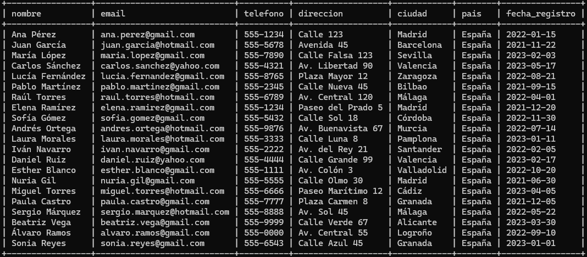

- Muestra los nombres y correos electrónicos de todos los clientes que residen en la ciudad de
Madrid.

````sql
SELECT nombre, email FROM clientes WHERE ciudad = 'Madrid';
````
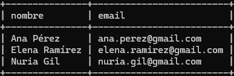

- Obtén una lista de productos con un precio mayor a $100, mostrando solo el nombre y el
precio.

````sql
SELECT nombre, precio FROM productos WHERE precio > 100;
````
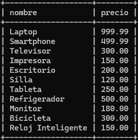

- Encuentra todos los empleados que tienen un salario superior a $2500, mostrando su
nombre, puesto y salario.

````sql
SELECT nombre, puesto, salario FROM empleados WHERE salario > 2500;
````
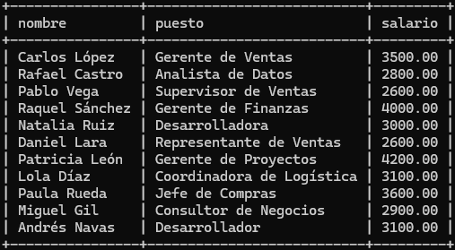

- Lista los nombres de los productos en la categoría "Electrónica", ordenados alfabéticamente.

````sql
SELECT nombre FROM productos WHERE categoria = 'Electrónica' ORDER BY nombre;
````


- Muestra los detalles de los pedidos que están en estado "Pendiente", incluyendo el ID del
pedido, el ID del cliente y la fecha del pedido.

````sql
SELECT pedido_id, cliente_id, fecha_pedido FROM pedidos WHERE estado = 'Pendiente';
````
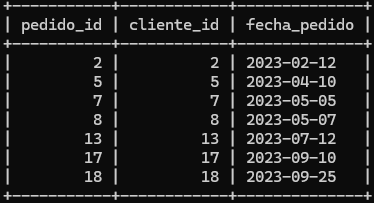

- Encuentra el nombre y el precio del producto más caro en la base de datos.

````sql
SELECT nombre, precio FROM productos ORDER BY precio DESC LIMIT 1;
````


- Obtén el total de pedidos realizados por cada cliente, mostrando el ID del cliente y el total de
pedidos.

````sql
SELECT cliente_id, COUNT(pedido_id) AS total_pedidos 
FROM pedidos 
GROUP BY cliente_id;
````
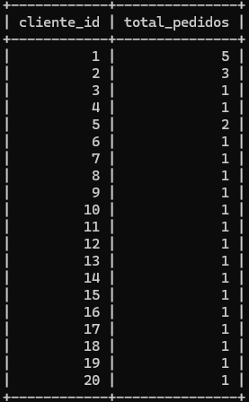

- Calcula el promedio de salario de todos los empleados en la empresa.

````sql
SELECT AVG(salario) AS promedio_salario FROM empleados;
````
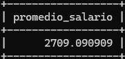

- Encuentra el número de productos en cada categoría, mostrando la categoría y el número de
productos

````sql
SELECT categoria, COUNT(producto_id) AS numero_productos  FROM productos GROUP BY categoria;
````
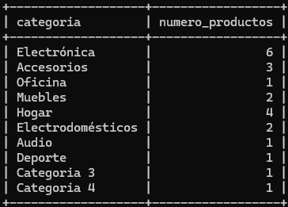


### Consultas multitabla (JOIN)

- Encuentra los nombres de los clientes y los detalles de sus pedidos.

````sql
SELECT c.nombre, p.pedido_id, p.fecha_pedido, p.estado
FROM clientes c
JOIN pedidos p ON c.cliente_id = p.cliente_id;
````
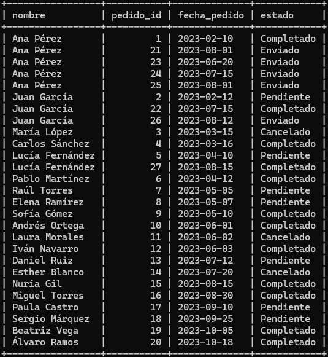

- Lista todos los productos pedidos junto con el precio unitario de cada pedido

````sql
SELECT pr.nombre AS producto, dp.precio_unitario
FROM productos pr
JOIN detalles_pedidos dp ON pr.producto_id = dp.producto_id;
````
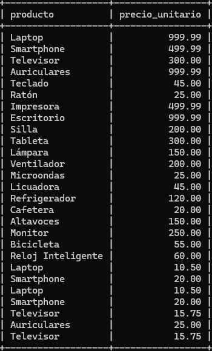

- Encuentra los nombres de los clientes y los nombres de los empleados que         gestionaron sus pedidos

````sql
SELECT c.nombre AS cliente, e.nombre AS empleado
FROM pedidos p
JOIN clientes c ON p.cliente_id = c.cliente_id
JOIN empleados e ON p.empleado_id = e.empleado_id;
````
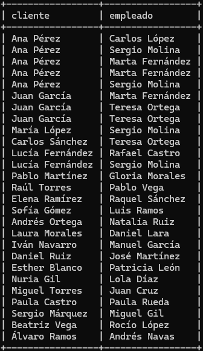

- Muestra todos los pedidos y, si existen, los productos en cada pedido, incluyendo los pedidos sin productos usando LEFT JOIN

````sql
SELECT p.pedido_id, dp.producto_id, dp.cantidad
FROM pedidos p
LEFT JOIN detalles_pedidos dp ON p.pedido_id = dp.pedido_id;
````
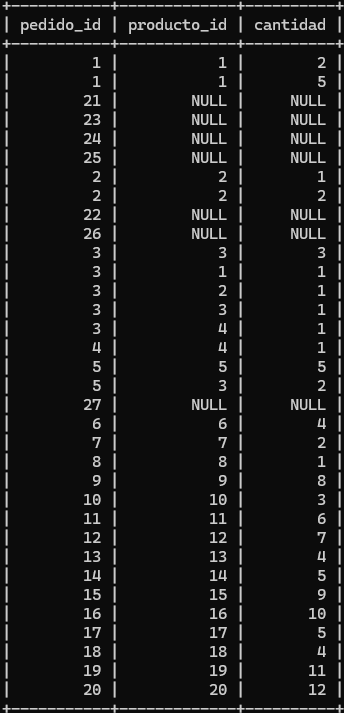

- Encuentra los productos y, si existen, los detalles de pedidos en los que no se ha incluido el producto usando RIGHT JOIN .

````sql
SELECT pr.nombre
FROM detalles_pedidos dp
RIGHT JOIN productos pr ON dp.producto_id = pr.producto_id
WHERE dp.producto_id IS NULL;
````
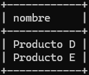

- Lista todos los empleados junto con los pedidos que han gestionado, si existen, usando LEFT JOIN para ver los empleados sin pedidos.

````sql
SELECT e.nombre, p.pedido_id
FROM empleados e
LEFT JOIN pedidos p ON e.empleado_id = p.empleado_id;
````
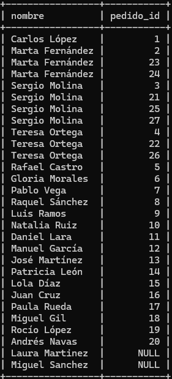

- Encuentra los empleados que no han gestionado ningún pedido usando un LEFT JOIN
combinado con WHERE.

````sql
SELECT e.nombre
FROM empleados e
LEFT JOIN pedidos p ON e.empleado_id = p.empleado_id
WHERE p.pedido_id IS NULL;
````
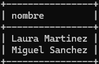

- Calcula el total gastado en cada pedido, mostrando el ID del pedido y el total, usando JOIN .

````sql
SELECT dp.pedido_id, SUM(dp.cantidad) AS total_cantidad, SUM(dp.precio_unitario) AS total_precio_unitario
FROM detalles_pedidos AS dp
GROUP BY dp.pedido_id;
````
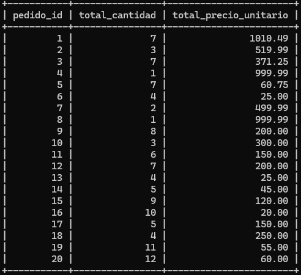

- Realiza un CROSS JOIN entre clientes y productos para mostrar todas las combinaciones posibles de clientes y productos.

````sql
SELECT c.nombre AS cliente, pr.nombre AS producto
FROM clientes c
CROSS JOIN productos pr;
````
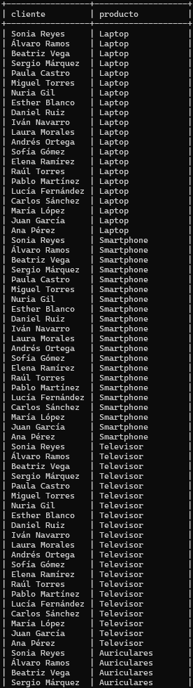 
- Encuentra los nombres de los clientes y los productos que han comprado, si existen,
incluyendo los clientes que no han realizado pedidos usando LEFT JOIN .

````sql
SELECT c.nombre AS cliente, pr.nombre AS producto
FROM clientes c
LEFT JOIN pedidos p ON c.cliente_id = p.cliente_id
LEFT JOIN detalles_pedidos dp ON p.pedido_id = dp.pedido_id
LEFT JOIN productos pr ON dp.producto_id = pr.producto_id;
````
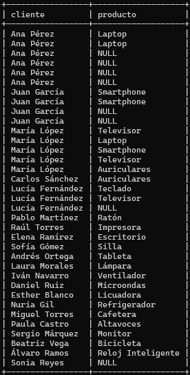


### Subconsultas

- Encuentra los nombres de los clientes que han realizado al menos un pedido de más de $500.

````sql
SELECT nombre
FROM clientes
WHERE cliente_id IN (
    SELECT cliente_id
    FROM pedidos
    JOIN detalles_pedidos ON pedidos.pedido_id = detalles_pedidos.pedido_id
    GROUP BY cliente_id
    HAVING SUM(detalles_pedidos.precio_unitario * detalles_pedidos.cantidad) > 500
);
````


- Muestra los productos que nunca han sido pedidos.

````sql
SELECT nombre
FROM productos
WHERE producto_id NOT IN (SELECT producto_id FROM detalles_pedidos);
````
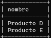

- Lista los empleados que han gestionado pedidos en los últimos 6 meses.

````sql
SELECT nombre
FROM empleados
WHERE empleado_id IN (
    SELECT empleado_id
    FROM pedidos
    WHERE fecha_pedido >= DATE_SUB(CURDATE(), INTERVAL 6 MONTH)
);
````

- Encuentra el pedido con el total de ventas más alto.

````sql
SELECT pedido_id, SUM(precio_unitario * cantidad) AS total
FROM detalles_pedidos
GROUP BY pedido_id
ORDER BY total DESC
LIMIT 1;
````
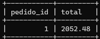

- Muestra los nombres de los clientes que han realizado más pedidos que el promedio de pedidos de todos los clientes.

````sql
SELECT nombre
FROM clientes
WHERE cliente_id IN (
    SELECT cliente_id
    FROM pedidos
    GROUP BY cliente_id
    HAVING COUNT(*) > (
        SELECT AVG(total_pedidos) FROM (
            SELECT COUNT(*) AS total_pedidos
            FROM pedidos
            GROUP BY cliente_id
        ) AS promedio_pedidos
    )
);
````
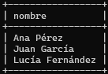

- Obtén los productos cuyo precio es superior al precio promedio de todos los productos.

````sql
SELECT nombre
FROM productos
WHERE precio > (SELECT AVG(precio) FROM productos);
````
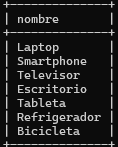

- Lista los clientes que han gastado más de $1,000 en total.

````sql
SELECT c.nombre AS nombre_cliente, SUM(dp.precio_unitario * dp.cantidad) AS total_gastado
FROM clientes c
JOIN pedidos p ON c.cliente_id = p.cliente_id
JOIN detalles_pedidos dp ON p.pedido_id = dp.pedido_id
GROUP BY c.cliente_id
HAVING total_gastado > 1000;
````
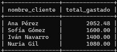

- Encuentra los empleados que ganan un salario mayor al promedio de la empresa.

````sql
SELECT nombre
FROM empleados
WHERE salario > (SELECT AVG(salario) FROM empleados);
````


- Obtén los productos que generaron ingresos mayores al ingreso promedio por producto.

````sql
SELECT nombre
FROM productos
WHERE producto_id IN (
    SELECT producto_id
    FROM detalles_pedidos
    GROUP BY producto_id
    HAVING SUM(precio_unitario * cantidad) > (
        SELECT AVG(ingreso) FROM (
            SELECT SUM(precio_unitario * cantidad) AS ingreso
            FROM detalles_pedidos
            GROUP BY producto_id
        ) AS promedio_ingresos
    )
);
````
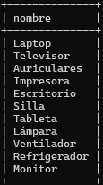

- Encuentra el nombre del cliente que realizó el pedido más reciente.

````sql
SELECT nombre
FROM clientes
WHERE cliente_id = (
    SELECT cliente_id
    FROM pedidos
    ORDER BY fecha_pedido DESC
    LIMIT 1
);
````
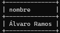

- Muestra los productos pedidos al menos una vez en los últimos 3 meses.

````sql
SELECT nombre
FROM productos
WHERE producto_id IN (
    SELECT producto_id
    FROM detalles_pedidos dp
    JOIN pedidos p ON dp.pedido_id = p.pedido_id
    WHERE p.fecha_pedido >= DATE_SUB(CURDATE(), INTERVAL 3 MONTH)
);
````

- Lista los empleados que no han gestionado ningún pedido.

````sql
SELECT nombre
FROM empleados
WHERE empleado_id NOT IN (SELECT empleado_id FROM pedidos);
````
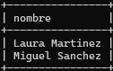

- Encuentra los clientes que han comprado más de tres tipos distintos de productos.

````sql
SELECT nombre
FROM clientes
WHERE cliente_id IN (
    SELECT cliente_id
    FROM pedidos p
    JOIN detalles_pedidos dp ON p.pedido_id = dp.pedido_id
    JOIN productos pr ON dp.producto_id = pr.producto_id
    GROUP BY cliente_id
    HAVING COUNT(DISTINCT pr.categoria) > 3
);
````

- Muestra el nombre del producto más caro que se ha pedido al menos cinco veces.

````sql
SELECT nombre
FROM productos
WHERE producto_id = (
    SELECT producto_id
    FROM (
        SELECT producto_id
        FROM detalles_pedidos
        GROUP BY producto_id
        HAVING SUM(cantidad) >= 5
        ORDER BY MAX(precio_unitario) DESC
        LIMIT 1
    ) AS subquery
);
````


- Lista los clientes cuyo primer pedido fue un año después de su registro.

````sql
SELECT nombre
FROM clientes c
WHERE EXISTS (
    SELECT 1
    FROM pedidos p
    WHERE c.cliente_id = p.cliente_id
    AND DATEDIFF(p.fecha_pedido, c.fecha_registro) >= 365
    ORDER BY p.fecha_pedido
    LIMIT 1
);
````


- Encuentra los nombres de los productos que tienen un stock inferior al promedio del stock de todos los productos.

````sql
SELECT nombre
FROM productos
WHERE stock < (SELECT AVG(stock) FROM productos);
````
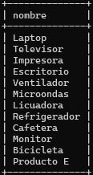

- Lista los clientes que han realizado menos de tres pedidos.

````sql
SELECT nombre
FROM clientes
WHERE cliente_id IN (
    SELECT cliente_id
    FROM pedidos
    GROUP BY cliente_id
    HAVING COUNT(cliente_id) < 3
);
````


- Encuentra los nombres de los productos que fueron pedidos por los clientes que registraron en el último año.

````sql
SELECT nombre
FROM productos
WHERE producto_id IN (
    SELECT dp.producto_id
    FROM detalles_pedidos dp
    JOIN pedidos p ON dp.pedido_id = p.pedido_id
    JOIN clientes c ON p.cliente_id = c.cliente_id
    WHERE c.fecha_registro >= DATE_SUB(CURDATE(), INTERVAL 1 YEAR)
);
````

- Obtén el nombre del empleado que gestionó el mayor número de pedidos.

````sql
SELECT nombre
FROM empleados
WHERE empleado_id = (
    SELECT empleado_id
    FROM pedidos
    GROUP BY empleado_id
    ORDER BY COUNT(*) DESC
    LIMIT 1
);
````


- Lista los productos que han sido comprados en cantidades mayores que el promedio de
cantidad de compra de todos los productos.

````sql
SELECT nombre
FROM productos
WHERE producto_id IN (
    SELECT producto_id
    FROM detalles_pedidos
    GROUP BY producto_id
    HAVING AVG(cantidad) > (SELECT AVG(cantidad) FROM detalles_pedidos)
);
````
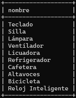